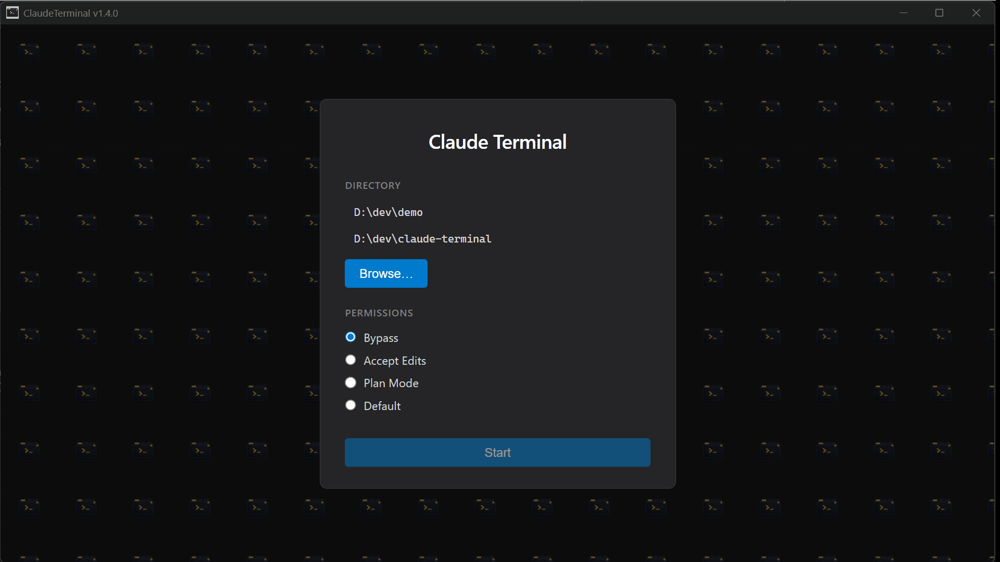

# ClaudeTerminal

[](https://github.com/Mr8BitHK/claude-terminal/releases/latest)
[](LICENSE)
[](#download)



A tabbed terminal manager for running multiple **Claude Code** sessions side by side — with session persistence, git worktree integration, and auto-naming.

Think Windows Terminal, but purpose-built for Claude Code.

## Why ClaudeTerminal?

If you use Claude Code, you've probably found yourself juggling multiple terminal windows — one for your main task, one for a bug fix on a worktree, a shell tab for git operations. ClaudeTerminal puts all of that in one window with:

- **Visual status at a glance** — see which sessions are working, idle, or need input without switching tabs
- **Session persistence** — close the app, reopen it, pick up where you left off
- **One-click worktrees** — `Ctrl+W` creates a git worktree and scopes a new Claude session to it
- **No context pollution** — each tab is isolated, with auto-generated descriptive names
- **Desktop notifications** — get notified when a background session finishes or needs attention

## Download

Grab the latest release for your platform:

**[Download from GitHub Releases](https://github.com/Mr8BitHK/claude-terminal/releases/latest)**

| Platform | Format |
|----------|--------|
| Windows  | `.exe` installer |
| macOS    | `.zip` |
| Linux    | `.deb`, `.rpm` |

> **Prerequisites:** [Claude Code CLI](https://docs.anthropic.com/en/docs/claude-code) must be installed and authenticated.
>
> Windows is the primary platform. macOS and Linux builds are provided but less tested.

## Features

### Tabbed Claude Code Sessions
- **Claude tabs** — open multiple Claude Code sessions, each in its own terminal
- **Shell tabs** — open plain PowerShell or WSL terminals alongside Claude sessions, with distinct icons per shell type
- **Auto-naming** — uses Claude Haiku to analyze your first prompt and automatically generate descriptive tab names (e.g. "Auth Bug Fix" instead of "Tab 3")

### Session Persistence
- Tabs, names, and working directories are saved automatically on every state change
- Full session restoration on app restart — every Claude session resumes exactly where you left off

### Git Worktree Integration
- Built-in worktree manager
- Open new Claude sessions scoped to a specific worktree with `Ctrl+W`
- Branches from the current directory's git branch, not just main

### Repository Hooks
- Configure shell commands that run automatically on lifecycle events like `worktree:created`, `tab:created`, `session:started`, and more
- Managed via a built-in UI dialog — no config files to edit manually
- Per-repository config stored in `.claude-terminal/hooks.json`

**Example:** Auto-install dependencies when a new worktree is created:
```json
{
  "hooks": [
    {
      "id": "install-deps",
      "name": "Install dependencies",
      "event": "worktree:created",
      "commands": [
        { "path": ".", "command": "pnpm i" }
      ],
      "enabled": true
    }
  ]
}
```


### Status & Notifications
- **Per-tab status icons** — animated icons show whether each session is working, idle, or needs input
- **Window title** — displays aggregate status (Idle/Working) so you can see it in your taskbar
- **Status bar** — session status summary and keyboard shortcut hints
- **Desktop notifications** — native OS notifications when Claude sessions complete tasks, encounter errors, or need your attention. Clicking a notification focuses the relevant tab.

### Remote Access
- Access your ClaudeTerminal sessions from any device via a Cloudflare tunnel
- One-click activation generates a short access code and QR code
- Read-only web client — view terminal output from your phone or another machine
- Auto-reconnect on connection drops

## Keyboard Shortcuts

| Shortcut | Action |
|----------|--------|
| `Ctrl+T` | New Claude tab |
| `Ctrl+W` | New worktree tab |
| `Ctrl+Shift+P` | New PowerShell tab |
| `Ctrl+Shift+L` | New WSL tab |
| `Ctrl+Tab` | Next tab |
| `Ctrl+Shift+Tab` | Previous tab |
| `Ctrl+1`–`Ctrl+9` | Jump to tab by number |
| `Ctrl+F4` | Close tab |

## Build from Source

```bash
# Prerequisites: Node.js, pnpm
pnpm install
pnpm start        # Development
pnpm run make     # Build installer
```

## Acknowledgements

Some features were inspired by [Maestro](https://runmaestro.ai/), a multi-agent orchestration tool for Claude Code.

## License

[MIT](LICENSE)
