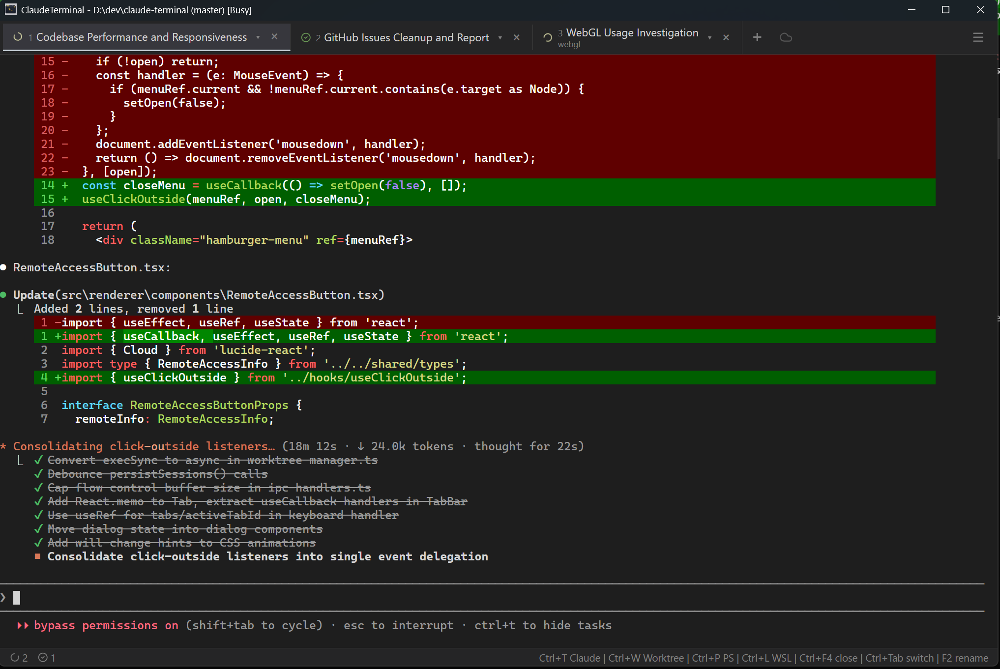

# Claude Terminal



A Windows desktop app (Electron) that serves as a **tabbed terminal manager for Claude Code sessions**.

Like Windows Terminal, but purpose-built for running multiple Claude Code CLI instances in tabs within one window, with session persistence and keyboard shortcuts.

## Features

### Tabbed Claude Code Sessions
- **Claude tabs** - Open multiple Claude Code sessions on the main work dir or create a worktree, each in its own terminal
- **Shell tabs** — open plain PowerShell or WSL terminals alongside Claude sessions, with distinct icons per shell type
- **Auto-naming** — uses Claude Haiku (via Claude Code CLI) to analyze your first prompt and automatically generate descriptive tab names

### Session Persistence
- Tabs, names, and working directories are saved automatically on every state change
- Full session restoration on app restart — pick up right where you left off (claude sessions only)

### Git Worktree Integration
- Built-in worktree manager
- Open new Claude sessions scoped to a specific worktree with `Ctrl+W` (branches from the current directory's git branch, not just main)

### Status & Notifications
- **Per-tab status icons** — animated icons show status of each session
- **Window title** — displays status (Idle/Working)
- **Status bar** — Session status summary and keyboard shortcut hints
- **Desktop notifications** - when Claude sessions need attention or complete tasks

## Getting Started

### Prerequisites

- Node.js
- [Claude Code CLI](https://docs.anthropic.com/en/docs/claude-code) installed and authenticated

### Install & Run

```bash
npm install
npm start
```

### Build

```bash
npm run make
```

Produces a Windows installer in the `out/` directory.

## License

MIT
